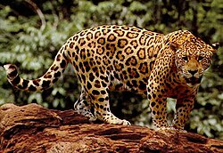

# Etiquetas básicas


## Indica que estamos utilizando HTML5.

```html
<!DOCTYPE html>
```


## Indica que el documento está escrito en español.
```html
<html lang="es">
```


## Contiene información sobre el documento.
```html
<head>
```

## Contiene aquello que verá el usuario.

```html
<body>
```

# Uso de elementos de la  web semántica

*HTML5 no solamente sirve para mostrar información; también permite describir qué significa cada parte de la página.*


```html
<body>

    <header>
        <h1>BioNoticias</h1>
        <p>Actualidad sobre biodiversidad y conservación</p>
    </header>

    <nav>
        <a href="#">Inicio</a>
        <a href="#">Noticias</a>
        <a href="#">Especies</a>
        <a href="#">Conservación</a>
        <a href="#">Videos</a>
    </nav>

    <main>

        <section>
            <h2>Noticias destacadas</h2>

            <article>
                <h3>El jaguar vuelve a recorrer los bosques mexicanos</h3>
                <p>
                    Investigadores reportan nuevos registros de jaguares
                    en zonas de conservación.
                </p>
            </article>

        </section>

    </main>

    <footer>
        <p>© 2026 BioNoticias</p>
    </footer>

</body>

```

Por ejemplo:

```html
<article>
```


indica que tenemos un contenido independiente, en este caso una noticia.


# Creación del menú 

La versión anterior

```html
 <nav>
        <a href="#">Inicio</a>
        <a href="#">Noticias</a>
        <a href="#">Especies</a>
        <a href="#">Conservación</a>
        <a href="#">Videos</a>
    </nav>
```

Se reemplaza por:

```html
<nav class="menu">
    <div class="logo">
        BioNoticias
    </div>
    <div class="enlaces">
        <a href="#inicio">Inicio</a>
        <a href="#noticias">Noticias</a>
        <a href="#especies">Especies</a>
        <a href="#conservacion">Conservación</a>
        <a href="#videos">Videos</a>
    </div>
</nav>
```


Los enlaces utilizan:

```html
href="#noticias"
```

para desplazarse hacia un elemento que tenga:

```html
id="noticias"
```


Por ejemplo:

```html
<section id="noticias">
```

Esto nos permitirá posteriormente crear un efecto de desplazamiento suave con CSS.


# Agregar el primer artículo a la página de noticias

Sustituir el *article* anterior.

```html
<article class="noticia">

    

    <div class="noticia-contenido">

        <span class="categoria">
            Conservación
        </span>

        <h3>
            El jaguar vuelve a recorrer los bosques mexicanos
        </h3>

        <p>
            Nuevos registros obtenidos mediante cámaras trampa
            muestran la presencia de jaguares en diferentes
            regiones naturales.
        </p>

        <time datetime="2026-09-05">
            5 de septiembre de 2026
        </time>

        <a href="#" class="leer-mas">
            Leer noticia ...
        </a>

    </div>

</article>
```


## Elementos relevantes


### alt
```html
alt="Jaguar en un bosque tropical"
```

Ayuda a:

* accesibilidad
* lectores de pantalla
* motores de búsqueda


### time
```html
<time datetime="2026-09-05">
```

Permite identificar semánticamente una fecha.

### Visualmente, se obtiene:


# Agregar 3 noticias similares

* <article> para colibrí
* <article> para bosque
* <article> para tortuga

Ejemplos: 


# Hoja de estilo externa

En el `<head>` agregamos:

```html
<link rel="stylesheet" href="css/estilos.css">
```

Crear `css/estilos.css`

```css
* {
    box-sizing: border-box;
    margin: 0;
    padding: 0;
}

body {
    font-family: Arial, sans-serif;
    background-color: #f4f7f2;
    color: #263326;
}
```

Se obtiene un pequeño cambio visual


# Ajustes  en el encabezado


```css
header {
    background-color: #183d2b;
    color: white;
    text-align: center;
    padding: 60px 20px;
}

header h1 {
    font-size: 3rem;
    margin-bottom: 10px;
}

header p {
    font-size: 1.2rem;
}
```

Se mejora el título de la página 


# Ajustes  en el Menú


```css
.menu {
    display: flex;
    justify-content: space-between;
    align-items: center;

    background-color: #10271c;

    padding: 15px 8%;

    position: sticky;
    top: 0;

    z-index: 1000;
}

.logo {
    color: white;
    font-size: 1.5rem;
    font-weight: bold;
}

.enlaces {
    display: flex;
    gap: 25px;
}

.enlaces a {
    color: white;
    text-decoration: none;
}

```


* `display: flex;`
Activa el modelo de caja flexible (Flexbox). Convierte al menú en un contenedor flexible y a sus elementos hijos (como el logo y los enlaces) en elementos flexibles, permitiendo alinearlos y distribuirlos fácilmente sin usar floats o posicionamientos complejos.

* `justify-between: space-between;` Distribuye el espacio disponible de forma horizontal. Coloca el primer elemento al inicio (extremo izquierdo) y el último elemento al final (extremo derecho), dejando un espacio uniforme entre los elementos intermedios. 
Separa el logo del menú de navegación.

* `align-items: center;`Alinea todos los elementos hijos de forma vertical justo en el centro del contenedor. Evita que el texto o los botones queden desalineados si tienen alturas diferentes.


* `background-color: #10271c;` Aplica un color de fondo al menú. En este caso, `#10271c` corresponde a un verde oscuro, ideal para temáticas de naturaleza o conservación.

* `padding: 15px 8%;` Define el espacio interior del menú para que el contenido no toque los bordes. El primer valor (15px) aplica arriba y abajo; el segundo valor (8%) aplica a la izquierda y derecha. 
Usar un porcentaje en los laterales ayuda a que el contenido del menú se mantenga centrado y alineado con el diseño general de la página en pantallas anchas.

* `position: sticky;` El menú permanece visible cuando el usuario desplaza la página. Es un híbrido entre posición relativa y fija. El menú se comporta de manera normal al scroll, pero se "pega" a la pantalla en cuanto el usuario empieza a bajar, manteniéndose siempre a la vista.

*  `top: 0;` Es el complemento obligatorio de sticky. Determina la distancia exacta donde se va a congelar el menú. Al poner 0, se indica  que se quede atrapado justo en el borde superior de la ventana del navegador.

* `z-index: 1000;` Controla el orden de superposición en el eje "Z" (profundidad). Al asignarle un valor alto como 1000, se asegura de que el menú siempre flote por encima de las imágenes, textos o tarjetas de la página mientras el usuario hace scroll hacia abajo.

## Mejoras en el menú


# Efecto CSS: hover


```css
.enlaces a {
    color: white;
    text-decoration: none;
    transition: 0.3s;
}

.enlaces a:hover {
    color: #9bd18b;
}
```


## probar


```css
.enlaces a {
    color: white;
    text-decoration: none;
    display: inline-block; /* Obligatorio para transform */
    transition: 0.3s;
}

.enlaces a:hover {
    color: #9bd18b;
    transform: scale(1.1); /* Incrementa el tamaño un 10% */
}

```

## Probar

```css
.enlaces a {
    color: white;
    text-decoration: none;
    display: inline-block;
    transition: 0.3s;
}

.enlaces a:hover {
    color: #9bd18b;
    transform: translateY(-4px); /* Desplaza 4 píxeles hacia arriba */
}

```

# Tarjetas


Agrupar los artículos en la siguiente estructura 


Y aplicar el estilo:


```css
.grid-noticias {
    width: 85%;
    max-width: 1200px;
    margin: 40px auto;
    display: grid;
    grid-template-columns: repeat(3, 1fr);
    gap: 25px;
}
```


### Se obtiene


# Articulos


```css
.noticia {
    background-color: white;

    border-radius: 12px;

    overflow: hidden;

    box-shadow:
        0 5px 15px rgba(0,0,0,0.1);

    transition:
        transform 0.3s,
        box-shadow 0.3s;
}

```


## Efectos hover sobre noticias


```css
.noticia:hover {
    transform: translateY(-8px);

    box-shadow:
        0 15px 30px rgba(0, 0, 0, 0.2);

    transition: 0.5s;
}
```


### Efecto "Vidrio Flotante" (Glassmorphism + Brillo)

Esta variante combina una elevación ligera con una sombra muy difuminada y un borde que se ilumina. Ideal para diseños modernos o con fondos oscuros.

```css
.noticia {
  transition: transform 0.3s cubic-bezier(0.25, 0.8, 0.25, 1), 
              box-shadow 0.3s ease, 
              border-color 0.3s ease;
  border: 1px solid rgba(0, 0, 0, 0.05);
}

.noticia:hover {
  transform: translateY(-6px);
  /* Sombra más suave y expandida */
  box-shadow: 0 20px 40px rgba(0, 0, 0, 0.08);
  /* El borde se aclara o toma color */
  border-color: #3182ce; 
}
```


## Minimalista 2D (Borde de Enfoque)

Evita que las tarjetas se muevan por la pantalla, en cambio se usa un cambio de color plano y un borde inferior grueso que simula crecimiento.

```css
.noticia {
    transition: border-color 0.2s ease, background-color 0.2s ease;
    border-bottom: 4px solid transparent;
}

.noticia:hover {
    background-color: #f8fafc;
    /* Crea una línea de color en la base de la tarjeta */
    border-bottom-color: #3182ce;
}

```

##  Efecto Neumórfico de Profundidad (Glow de Color)

En lugar de una sombra negra tradicional, esta variante proyecta un sutil "halo" de luz , buscando un aspecto tecnológico.

```css
.noticia {
  transition: transform 0.3s ease, box-shadow 0.3s ease;
}

.noticia:hover {
  transform: translateY(-5px);
  /* Reemplaza el color azul (#3182ce) con una opacidad del 30% (4d) */
  box-shadow: 0 12px 24px rgba(49, 130, 206, 0.3); 
}

```
